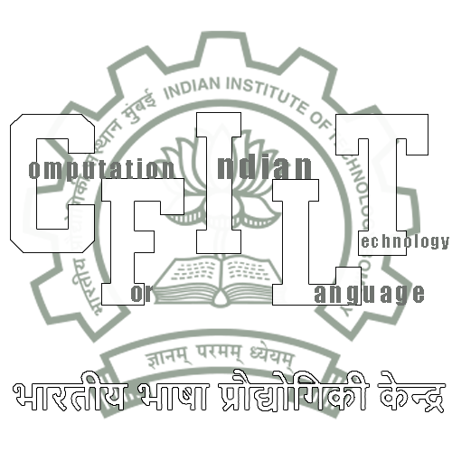
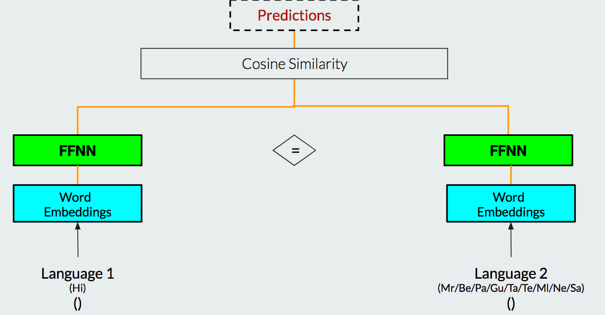

<p align="center"></p>

# Siamese Feed Forword Network for Cognate Detection

[](https://github.com/cfiltnlp/siamese-cognate-detection/issues)
[](https://github.com/cfiltnlp/siamese-cognate-detection/network)
[](https://github.com/cfiltnlp/siamese-cognate-detection/stargazers)
[](https://github.com/cfiltnlp/siamese-cognate-detection/blob/main/LICENSE)
[](https://twitter.com/cfiltnlp)

## About 

The repository contains the Siamese FeedFoward implementation for the NLP task of True Cogante Detection. It can be extended for various similarity measure tasks for textual input.The code is implemented using PyTorch framework and uses the FastText Word Embeddings (P. Bojanowski,et al. Enriching Word Vectors with Subword Information) for Word Vector Representation. The paper can be found [here](http://dipteshkanojia.github.io/publication/cods-2020-cognate/) and [here](https://dl.acm.org/doi/10.1145/3371158.3371207).

It should be noted that the work on this paper was carried out by Sravan Munukutla and Sayali Ghodekar. 

## Siamese FeedForward Architecture



Siamese Neural Networks tries to learn a common subspace, by tying the trainable parameters of the Network.It uses the same weights while working in tandem on two different input vectors to compute comparable output vectors. The output vectors are compared using similarity scores like cosine similarity, Manhattan or Euclidean distances. The above architecture is designed to detect True Cognates amongs various Indian language pairs. 

## Usage

```code
    git clone https://github.com/cfiltnlp/siamese-cognate-detection.git
```

For result reproducibility, please use the code provided here with the data which can be obtained from [here](https://github.com/cfiltnlp/challengeCognateFF).

## Maintainer(s)

[Sravan Munukutla](https://www.linkedin.com/in/sai-sravan-munukutla/)<br/>
[Sayali Ghodekar](https://sayalighodekar.github.io/)<br/>
[Diptesh Kanojia](https://dipteshkanojia.github.io)<br/>

## Citation

Kanojia, D., Munukutla, S., Ghodekar, S., Bhattacharyya, P. and Kulkarni, M., 2020. Keep your dimensions on a leash: True cognate detection using siamese deep neural networks. In Proceedings of the 7th ACM IKDD CoDS and 25th COMAD (pp. 324-325).

### BiBTeX Citation

```latex
@inproceedings{10.1145/3371158.3371207,
    author = {Kanojia, Diptesh and Munukutla, Sravan and Ghodekar, Sayali and Bhattacharyya, Pushpak and Kulkarni, Malhar},
    title = {Keep Your Dimensions on a Leash: True Cognate Detection Using Siamese Deep Neural Networks},
    year = {2020},
    isbn = {9781450377386},
    publisher = {Association for Computing Machinery},
    address = {New York, NY, USA},
    url = {https://doi.org/10.1145/3371158.3371207},
    doi = {10.1145/3371158.3371207},
    abstract = {Automatic Cognate Detection helps NLP tasks of Machine Translation, Information Retrieval, and Phylogenetics. Cognate words are defined as word pairs across languages which exhibit partial or full lexical similarity and mean the same (e.g., hund-hound in German-English). In this paper, we use a Siamese Feed-forward neural network with word-embeddings to detect such word pairs. Our experiments with various embedding dimensions show larger embedding dimensions can only be used for large corpora sizes for this task. On a dataset built using linked Indian Wordnets, our approach beats the baseline approach with a significant margin (up to 71\%) with the best F-score of 0.85\% on the Hindi-Gujarati language pair.},
    booktitle = {Proceedings of the 7th ACM IKDD CoDS and 25th COMAD},
    pages = {324–325},
    numpages = {2},
    keywords = {Cognate Detection, Word Embeddings, Indian Languages},
    location = {Hyderabad, India},
    series = {CoDS COMAD 2020}
}
```